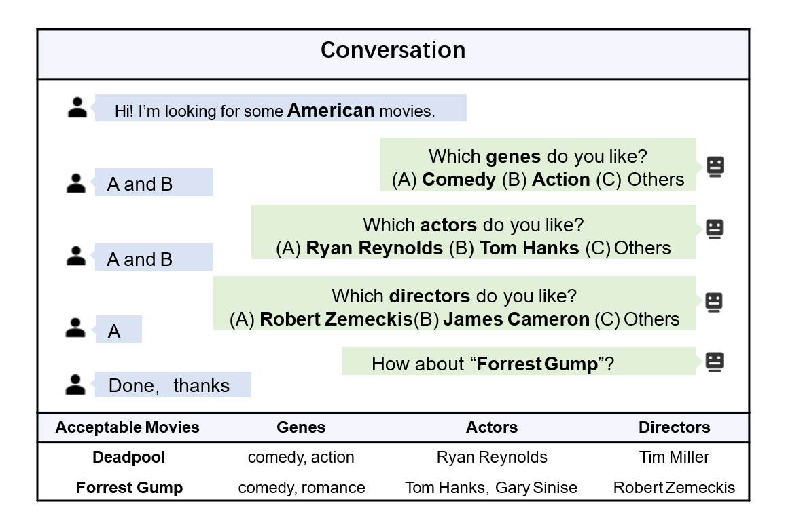

# MCMIPL

The implementation of _Multiple Choice Questions based Multi-Interest Policy Learning for Conversational Recommendation_ (WWW 2022). 



More descriptions are available via the [paper](https://arxiv.org/pdf/2112.11775.pdf).

The code is partially referred to [UNICORN](https://github.com/dengyang17/unicorn) and [SCPR](https://github.com/farrecall/SCPR).

## Environment Settings
python: 3.7.9

pytorch: 1.7.1 

dgl: 0.6.0

## Data Preparation
We have released the data, including lastfm_start, yelp_star,Amazon-Book and MovieLens.

If you would like to use your own dataset, you can reference the following step.
1. Put the user-item interaction data into the  fold /data/<data_name>/UI_Interaction_data, you can see the detial in [SCPR](https://github.com/farrecall/SCPR).
2. Processing data: `python graph_init.py --data_name <data_name>`
3. Use TransE [[OpenKE](https://github.com/thunlp/OpenKE)] to pretrain the graph embeddings. And put the pretrained embeddings under "/tmp/<data_name>/embeds/".


## Training
`python RL_model.py --data_name <data_name>`

## Evaluation
`python evaluate.py --data_name <data_name> --load_rl_epoch <checkpoint_epoch>`

<!-- ## Citation
If the code is used in your research, please star this repo and cite our paper as follows:
```
@inproceedings{DBLP:conf/sigir/DengL0DL21,
  author    = {Yang Deng and
               Yaliang Li and
               Fei Sun and
               Bolin Ding and
               Wai Lam},
  title     = {Unified Conversational Recommendation Policy Learning via Graph-based
               Reinforcement Learning},
  booktitle = {{SIGIR} '21: The 44th International {ACM} {SIGIR} Conference on Research
               and Development in Information Retrieval, Virtual Event, Canada, July
               11-15, 2021},
  pages     = {1431--1441},
  publisher = {{ACM}},
  year      = {2021},
}
``` -->
